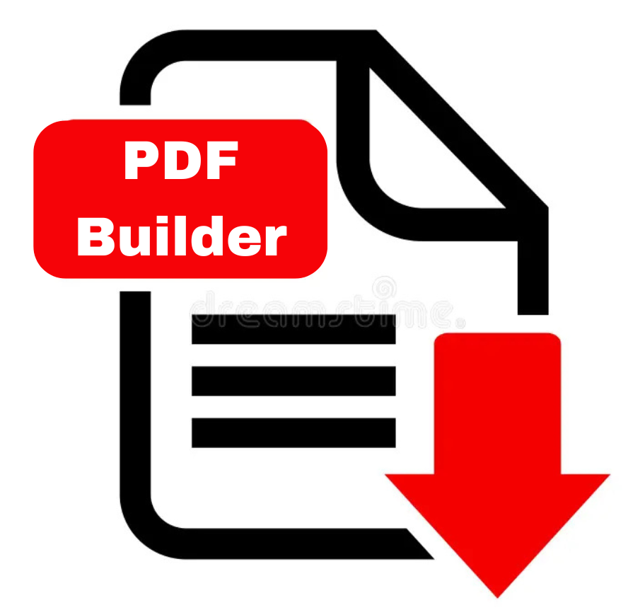

# PDFBuilderAPI


<table>
  <tr>
    <td>
      
    </td>
    <td>
      <h2>📋 Descripción</h2>
      <p>Esta es una API REST diseñada para automatizar la generación de PDFs. Puede ser implementada en proyectos de programación donde se requiere la generación de PDFs a partir de diferentes fuentes de datos.</p>
      
<h2>🚀 Funcionalidades</h2>
      <ol>
        <li>Convertir imágenes a PDF</li>
        <li>Convertir documentos a PDF</li>
        <li>Convertir datos JSON a PDFs personalizados</li>
      </ol>
    </td>
  </tr>
</table>

## 🛠 Stack Tecnológico

<div align="center">

[](https://nodejs.org/)
[](https://www.npmjs.com/)
[](https://expressjs.com/)
[](https://developer.mozilla.org/es/docs/Web/JavaScript)

</div>

## 📖 Documentación
La documentación completa de la API está disponible en el siguiente enlace: [Manual de la API](https://github.com/RitoTorri/PDFBuilderAPI/blob/main/docs/Manual.md)

Puedes encontrar el workspace de POSTMAN para probar los enpoint de la API en el siguiente enlace: [POSTMAN Workspace](https://ritotorri-5321757.postman.co/workspace/Cortez-Jes%C3%BAs-'s-Workspace~f2d04eac-b157-4c2b-8546-4c816e6a14a8/collection/48845560-e4484322-d8d7-48ce-b7ed-bc430007764d?action=share&creator=48845560&active-environment=48845560-3eb25b89-fab4-499d-8321-ee69fd59539c)

## ⚙️ Configuración de entorno
En la carpeta raíz de la API, hay un archivo `.env.example` que contiene las variables de entorno necesarias para ejecutar la API. Simplemente renombra el archivo a `.env` y rellena los valores correspondientes.

- **PORT**: Puerto donde se ejecutará la API. Por defecto es `3000`.

## 📦 Instalación
Ejecuta los siguientes comandos en la terminal para instalar el proyecto:

```bash
# Clonar el repositorio
git clone https://github.com/RitoTorri/PDFBuilderAPI.git

# Entrar en la carpeta del proyecto
cd PDFBuilderAPI

# Instalar las dependencias
npm install
```

## 🚀 Ejecución
Ejecuta el siguiente comando en la terminal para ejecutar el proyecto:

### Para desarrollo
```bash
# Ejecutar el servidor de desarrollo
npm run dev

# Ejecutar el servidor de producción
npm start
```

## 🐛 Issues 

Si encuentras algún **error 🐛**, **comportamiento inesperado 🔍** o tienes una **sugerencia de mejora 💡**, por favor crea un **issue 📋** en nuestro repositorio.

**Recuerda que:**
- Cada issue nos ayuda a mejorar la API 🚀
- Tu feedback es invaluable para el desarrollo 💝
- Juntos hacemos una mejor herramienta para todos 🤝