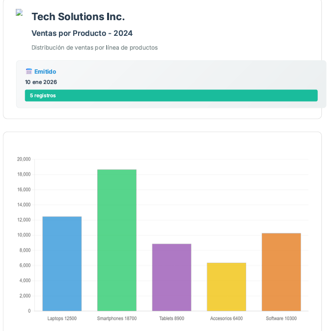
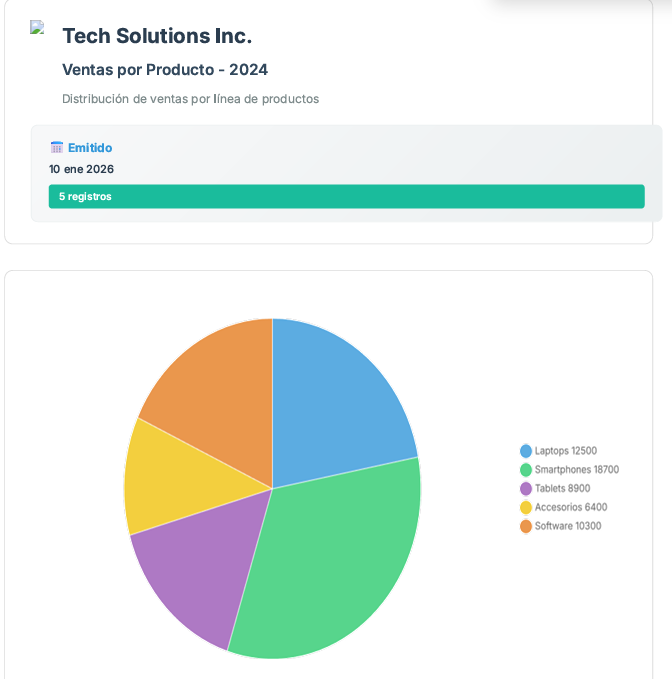
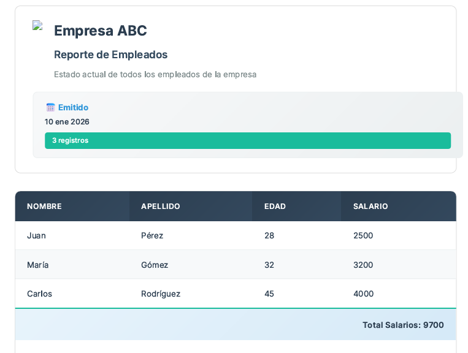

# PDFBuilderAPI - Manual de uso de la API 📄

Puedes encontrar el workspace de POSTMAN para probar los enpoint de la API en el siguiente enlace: [POSTMAN Workspace](https://ritotorri-5321757.postman.co/workspace/Cortez-Jes%C3%BAs-'s-Workspace~f2d04eac-b157-4c2b-8546-4c816e6a14a8/collection/48845560-e4484322-d8d7-48ce-b7ed-bc430007764d?action=share&creator=48845560&active-environment=48845560-3eb25b89-fab4-499d-8321-ee69fd59539c)

Si encuentras algún **error 🐛**, **comportamiento inesperado 🔍** o tienes una **sugerencia de mejora 💡**, por favor crea un **issue 📋** en nuestro repositorio.

**Recuerda que:**
- Cada issue nos ayuda a mejorar la API 🚀
- Tu feedback es invaluable para el desarrollo 💝
- Juntos hacemos una mejor herramienta para todos 🤝

## Índice 📋

- [📷 Convertir imágenes a PDF](#convertir-imágenes-a-pdf)
- [📊 Convertir JSON a PDF - Formato de tabla](#convertir-json-a-pdf---formato-de-tabla)
- [📈 Convertir JSON a PDF - Formato de gráfico de barras / torta](#convertir-json-a-pdf---formato-de-gráfico-de-barras--torta)
- [👁️ Ejemplos Visuales](#ejemplos-visuales)
- [⚖️ Comparación de formatos](#comparación-de-formatos)

## Convertir imágenes a PDF

**Endpoint:** `/api/pdf/builder/image/to/pdf`  
**Método HTTP:** `POST`  
**Header:** `Content-Type: application/json`

### Parámetros del cuerpo (JSON)

| Parámetro 🏷️ | Tipo 📦 | Requerido ✅ | Descripción 📝 |
|--------------|---------|-------------|----------------|
| `imagesPath` | Array[string] | **Sí** | Rutas absolutas de las imágenes a convertir |
| `outputPathPdf` | String | **Sí** | Ruta completa del archivo PDF de salida |

### Descripción

Convierte múltiples imágenes a un único archivo PDF. Las imágenes se procesan en el orden del array.

**Formatos de imagen soportados:** `.jpg`, `.jpeg`, `.png`

### ⚠️ IMPORTANTE

1. **📍 Rutas absolutas:** Todas las rutas deben ser absolutas
2. **📄 Extensión PDF:** La ruta de salida debe terminar en `Nombre-Del-Archivo.pdf`
3. **🔐 Permisos:** Asegúrate de tener permisos de lectura/escritura en la ruta de salida

### Ejemplo de solicitud

```json
{
  "imagesPath": [
    "C:/Users/Usuario/Pictures/imagen1.jpg",
    "C:/Users/Usuario/Pictures/imagen2.png"
  ],
  "outputPathPdf": "C:/Users/Usuario/Documents/documento.pdf"
}
```

**Respuestas:**

✅ Éxito:
```json
{
  "status": "200",
  "sucess": true,
  "message": "Url de la imagen convertida a PDF"
}
```

❌ Error:
```json
{
  "status": "400",
  "sucess": false,
  "message": "Mensaje de error"
}
```

## Convertir JSON a PDF - Formato de tabla

### Endpoint `/api/pdf/builder/json/to/pdf`

### Información Básica

- **Método HTTP:** `POST`
- **Content-Type:** `application/json`
- **Descripción:** Convierte datos estructurados en JSON a un documento PDF formateado con tablas

---

### Estructura General del Request

```json
{
  "PDFBuilder": {
    // Configuración del PDF aquí
  }
}
```

### Propiedades del PDFBuilder

#### 1. `type_report` 🔧 (Requerido)

Define el tipo de reporte a generar.

| Valor 🎯 | Descripción 📄 |
|----------|----------------|
| `"type_table"` | Genera un PDF con formato de tabla |

**Ejemplo:**

```json
{
  "PDFBuilder": {
    "type_report": "type_table"
  }
}
```

---

#### 2. `info_report` 🏢 (Requerido)

Contiene la información de encabezado del documento.

| Campo 📝 | Tipo 📦 | Requerido ✅ | Descripción ℹ️ |
|----------|---------|-------------|----------------|
| `company_name` | string | **Sí** | Nombre de la empresa/organización |
| `report_title` | string | **Sí** | Título principal del reporte |
| `company_logo` | string | No | URL de la imagen del logo |
| `description` | string | No | Descripción adicional del reporte |

**Estructura:**

```json
"info_report": {
    "company_name": "Nombre de la empresa",
    "report_title": "Título del reporte",
    "company_logo": "URL del logo",
    "description": "Descripción del reporte"
}
```

---

#### 3. `table_headings` 📑 (Requerido para tablas)

Define los encabezados de las columnas de la tabla.

**📌 Importante:**

- Las claves son identificadores internos para los datos
- Los valores son los textos que se mostrarán en el PDF
- Las claves deben coincidir exactamente con las propiedades en `data`

**Estructura:**

```json
"table_headings": {
  "campo_1": "Etiqueta de la columna 1",
  "campo_2": "Etiqueta de la columna 2",
  "campo_3": "Etiqueta de la columna 3"
}
```
---

#### 4. `data` 📋 (Requerido)

Array de objetos que contiene los datos a mostrar en la tabla.

**⚠️ Importante:** Cada objeto debe tener las mismas propiedades que las claves definidas en `table_headings`.

**Estructura:**

```json
"data": [
  {
    "campo_1": "Valor para campo 1",
    "campo_2": "Valor para campo 2",
    "campo_3": "Valor para campo 3"
  },
  {
    "campo_1": "Valor para campo 1",
    "campo_2": "Valor para campo 2",
    "campo_3": "Valor para campo 3"
  }
]
```

---

#### 5. `row_unique` 🧮 (Opcional)

Agrega filas especiales al final de la tabla para mostrar cálculos estadísticos.

**Estructura de cada objeto:**

```json
{
  "title": "Texto que se mostrará",
  "action": "tipo_de_calculo",
  "column_action": "nombre_de_la_columna"
}
```

**Acciones disponibles:**
| Valor 🎯 | Descripción 📊 |
|----------|----------------|
| `"sum"` ➕ | Suma todos los valores numéricos de la columna seleccionada |
| `"avg"` 📊 | Calcula el promedio de los valores de la columna seleccionada |

**Ejemplo:**

```json
"row_unique": [
    {
        "title": "Total de ventas",
        "action": "sum",
        "column_action": "ventas_mensuales"
    },
    {
        "title": "Promedio de edad",
        "action": "avg",
        "column_action": "edad_empleados"
    }
]
```

---

### Ejemplo Completo con Datos Reales

```json
{
    "pdfBuilder": {
        "type_report": "type_table",
        "info_report": {
            "company_logo": "https://ejemplo.com/logos/constructora-viva.png",
            "company_name": "Empresa ABC",
            "report_title": "Reporte de Empleados",
            "description": "Estado actual de todos los empleados de la empresa"
        },
        "table_headings": {
            "nombre": "Nombre",
            "apellido": "Apellido",
            "edad": "Edad",
            "salario": "Salario"
        },
        "data": [
            {
                "nombre": "Juan",
                "apellido": "Pérez",
                "edad": 28,
                "salario": 2500
            },
            {
                "nombre": "María",
                "apellido": "Gómez",
                "edad": 32,
                "salario": 3200
            },
            {
                "nombre": "Carlos",
                "apellido": "Rodríguez",
                "edad": 45,
                "salario": 4000
            }
        ],
        "row_unique": [
            {
                "title": "Total Salarios",
                "action": "sum",
                "column_action": "salario"
            }
        ]
    }
}
```

## Convertir JSON a PDF - Formato de gráfico de barras / torta

### Endpoint `/api/pdf/builder/json/to/pdf`

**Método HTTP:** `POST`  
**Content-Type:** `application/json`  
**Descripción:** Convierte datos estructurados en JSON a un documento PDF con gráfico de barras y torta.

### Notas Importantes 🎯

En el caso de los gráficos de barras y torta, se manejan los mismos parámetros entre ambos tipos de gráficos. Lo único que cambia es el `type_report`.

1. **Solo dos propiedades:** Cada objeto en `data` debe tener exactamente:
   - `title`: Texto para la etiqueta
   - `number`: Valor numérico para el gráfico

2. **Mismo endpoint:** Usa el mismo endpoint `/api/pdf/builder/json/to/pdf`

3. **Limite de datos:** El limite de objetos que puede tener el array `data` es de 10 objetos.

---

### Propiedades del PDFBuilder para gráficos

#### 1. `type_report` 🔧 (Requerido)
| Valor 🎯 | Descripción 📈 |
|----------|----------------|
| `"type_bar"` | Genera un PDF con gráfico de barras |
| `"type_pie"` | Genera un PDF con gráfico de torta |

**Ejemplo:**
```json
{
  "PDFBuilder": {
    "type_report": "type_bar" || "type_pie"
  }
}
```

---

#### 2. `info_report` 🏢 (Requerido)
Misma estructura que para tablas.

**Estructura:**
```json
"info_report": {
  "company_logo": "URL del logo (opcional)",
  "company_name": "Nombre de la empresa",
  "report_title": "Título del reporte",
  "description": "Descripción (opcional)"
}
```

---

#### 3. `data` 📊 (Requerido)
Array de objetos con los datos para el gráfico.

**Estructura:**
```json
"data": [
  {
    "title": "Nombre de la categoría",
    "number": "Valor numérico"
  },
  {
    "title": "Otra categoría", 
    "number": "Valor numérico"
  }
]
```

---

### Ejemplo Completo - Gráfico de Barras / Torta

```json
{
  "pdfBuilder": {
    "type_report": "type_bar",
    "info_report": {
      "company_logo": "https://ejemplo.com/logos/empresa.png",
      "company_name": "Tech Solutions Inc.",
      "report_title": "Ventas por Producto - 2024",
      "description": "Distribución de ventas por línea de productos"
    },
    "data": [
      {
        "title": "Laptops",
        "number": 12500
      },
      {
        "title": "Smartphones",
        "number": 18700
      },
      {
        "title": "Tablets",
        "number": 8900
      },
      {
        "title": "Accesorios",
        "number": 6400
      },
      {
        "title": "Software",
        "number": 10300
      }
    ]
  }
}
```

---

# Ejemplos Visuales

## 📈 Gráfico de Barras:
<div align="center">

</div>

## 🥧 Gráfico de Torta:
<div align="center">

</div>

## 📊 Resultado de Tabla
<div align="center">

</div>

---

## Comparación de Formatos

| Característica 🔧 | Tablas 📊 | Barras 📈 | Torta 🥧 |
|------------------|-----------|-----------|----------|
| `type_report` | `type_table` | `type_bar` | `type_pie` |
| `table_headings` | ✅ Requerido | ❌ No aplica | ❌ No aplica |
| `data` estructura | Objetos con múltiples propiedades | Array de `{title, number}` | Array de `{title, number}` |
| `row_unique` | ✅ Opcional | ❌ No aplica | ❌ No aplica |
| Uso ideal 💡 | Datos detallados, listas | Comparación de valores | Distribución porcentual |

---

**💡 Consejo final:** Siempre prueba con datos sencillos primero antes de enviar datos complejos. ¡La simplicidad es la clave del éxito! 🚀